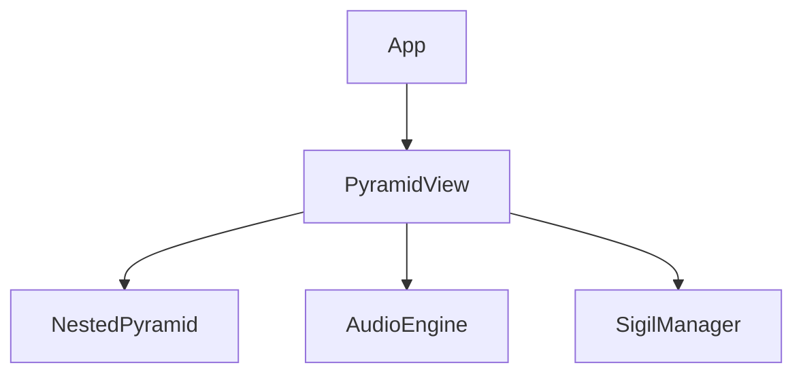

# AI-UI Pyramid Suite Blueprint

This document summarizes the final planning for the UnifiedMandala AI‑UI suite. The blueprint merges symbolic, ethical and synesthetic layers to create an interactive environment for intelligent agents and human collaborators.

## Key Features
- **Symbolzeit and Mandala Metaphor** for dynamic control and visualization.
- **CREP Engine** assessing coherence, resonance, emergence and presence.
- **Sigillin System** for cryptographic process steering and synchronization.
- **Agent Architecture** providing extensible modules for navigation, analysis and creative tasks.
- **Collaborative Editor and MemoryMesh** enabling collective reflection and co‑creation.
- **Synesthetic Visualization** with 3D pyramids, sound and color feedback.

## Recommendations
- Provide a **tutorial mode** and guided tours for newcomers.
- Offer an **online sandbox** for quick proofs of concept.
- Expand **internationalization** to reach a broader community.
- Prepare **user story driven showcases** for research, education and art.

## Presentation Ideas
- Position UnifiedMandala as *"The World's First Synesthetic & Ethical Symbolic AI‑UI"*.
- Highlight the contrast between mainstream text‑based tools and UnifiedMandala's experiential approach.
- Provide short videos, feature charts and a framework comparison.
- Include the example abstract from `newadvancedconversations.json` for scientific papers.

## Next Steps
- Create slidesets or poster templates for conferences.
- Develop demo notebooks and user‑flow examples.
- Generate a feature comparison graphic.

## Hardcode Blueprint
This section was added following the Pyramid UI conversation. It outlines a minimal scaffold for the upcoming Pyramid UI implementation.

