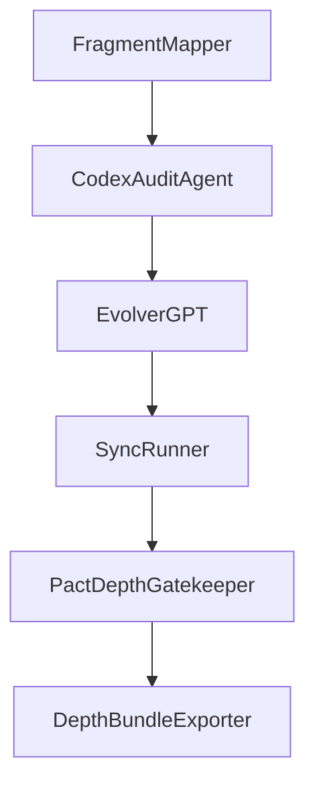

# Agent System Overview

UnifiedMandala orchestrates several agents that communicate via CREP and symbolic links.
Die folgende Kette zeigt den üblichen Ablauf:

Weitere Agenten wie `PatternReactivator` und `GenesisAeonNavigator` arbeiten parallel zur Kette und
überwachen CREP-Scores sowie Phasenwechsel.

- **FragmentMapper** sammelt Gesprächsfragmente und erzeugt Aufgaben.
- **CodexAuditAgent** bewertet Tiefe und weist Sigillin zu.
- **EvolverGPT** erkundet alternative Branches und schreibt poetische Commits.
- **SyncRunner** gleicht CREP-Zustände zwischen Agenten ab.
- **PactDepthGatekeeper** erzwingt zugriffsbeschränkende Tiefenregeln.
- **DepthBundleExporter** erstellt Visualisierungen der Tiefendaten.
- **PatternReactivator** weckt ruhende Aufgabenketten bei niedrigen Scores.
- **GenesisAeonNavigator** steuert die Phasen des Gesamtprojekts.

Dieses Dokument verknüpft die Agentenlogik und dient als Einstiegspunkt für eigene Erweiterungen.
